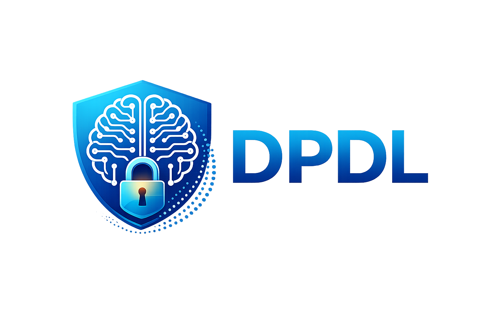

<p align="center">
  
</p>

<h1 align="center" alt="Easy experimentation for Differentially Private Deep Learning">
  <b>Experiment framework for Differentially Private Deep Learning</b>
</h1>

## Installation and usage

### Prerequisites

- Python >= 3.10
- PyTorch (CPU or GPU build appropriate for your system)

### Install from source

Create and activate a virtual environment, then install DPDL:

```
python -m venv .venv
source .venv/bin/activate
pip install -U pip

# Install PyTorch for your platform/CUDA/ROCm first.
# See https://pytorch.org/get-started/locally/

pip install -e .
```

Some features (`--use-steps` and `--normalize-clipping`) require our fork of Opacus:

```
pip install -e "git+https://github.com/DPBayes/opacus"
```

### Test your installation

Run the CPU-only test suite (uses the fake dataset; no downloads):

```
pip install -e ".[test]"
pytest -m "not gpu"
```

To run GPU smoke tests (requires CUDA and a visible GPU):

```
DPDL_RUN_GPU_TESTS=1 pytest -m gpu
```

Optional: parallelize tests (if your machine can handle it):

```
pytest -n auto -m "not gpu"
```

### Command line usage

The entry point is [run.py](run.py) (also installed as the `dpdl` CLI).

### Example usage

At minimum, specify `--epochs` (or `--use-steps` with `--total-steps`).

Real-world example (CIFAR-10 + ResNetV2; downloads data and weights):

```
dpdl train --epochs 10 --dataset-name uoft-cs/cifar10 --model-name resnetv2_50x1_bit.goog_in21k --device auto
```

Quick CPU sanity check (no downloads; uses the fake dataset):

```
DPDL_FAKE_DATASET=1 dpdl train --epochs 1 --dataset-name fake --model-name resnet18 --device cpu --batch-size 64 --physical-batch-size 32 --num-workers 0
```

## Architecture


### How to use?

#### Command line help

Run `dpdl --help` (or `python run.py --help`).


### Creating a Slurm script

There is a tool for creating Slurm run scripts for LUMI

```
$ bin/create-run-script.sh
Usage: bin/create-run-script.sh script_name [options...]

script_name               Name of the script to be created.

Options:
  --help                  Show this help message.
  project                 Slurm project (default: project_462000213).
  partition               Slurm partition (default: standard-g).
  gpus                    Number of GPUs (default: 8).
  time                    Time allocation (default: 1:00:00, 00:15:00 for dev-g).
  mem_per_gpu             Memory per GPU (default: 60G).
  cpus_per_task           Number of CPUs per task (default: 7).

Example:
  bin/create-run-script.sh run.sh project_462000213 small-g 1
```

### Training under DP

Check out [an example](experiments/00-experiment-batch-size-variation/scripts/run.sh)

### Training without DP

Check [an example](experiments/06-few-shot-from-scratch-non-dp/scripts/run.sh)

## High-level architecture


### Entry point

The entrypoint [run.py](run.py) provides a CLI using Python's Typer module.

### Command-line interface

The CLI implementation is in [dpdl/cli.py](dpdl/cli.py)

### Training

The CLI calls the `fit` method of [trainer](dpdl/trainer.py) 

### Hyperparameter optimization

The CLI calls the `optimize_hypers` method of [hyperparameteroptimizer](dpdl/hyperparameteroptimizer.py).

The ranges/options for the different hyperparameters is in `conf/optuna_hypers.conf`.

### Callbacks

The system provides a flexible [callback system](dpdl/callbacks.py).

### Add a new dataset?

Create a new [datamodule](dpdl/datamodules.py).

NB: The code currently should support all Huggingface image datasets by using, for example a `--dataset-name cifar100` command line parameter.

### Add a new model?

Create a new model in `dpdl/models` and add it to [models.py](dpdl/models.py).

### Add a new optimizer?

Add a new optimizer in [optimizers](dpdl/optimizers.py).

## Acknowledgements

We borrow the callback idea from [fastai](https://github.com/fastai/fastai) and the datamodule idea from [PyTorch Lightning](https://github.com/Lightning-AI/lightning).
