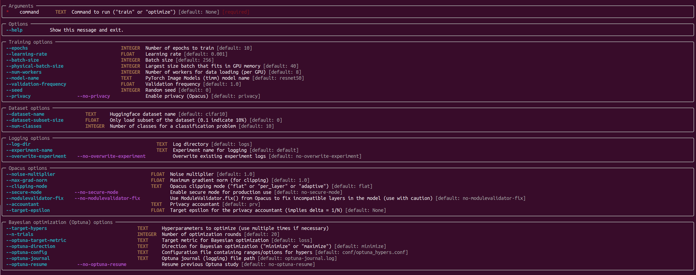
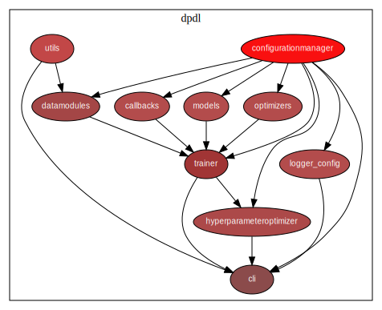

# Easy experimentation for Differentially Private (DP) Deep Learning

The system requires CUDA. We provide scripts for running in a Slurm environment.

Many of the ideas that we are using come from [fastai](https://github.com/fastai/fastai) and [PyTorch Lightning](https://github.com/Lightning-AI/lightning).

## Experiments

## Installation and usage

### Install dependencies

`pip install torch opacus timm datasets typer[all] optuna torchmetrics pydantic`

### Command line usage

Entry point is [run.py](blob/vanilla-pytorch-refactor/run.py).

### How to use? Even when running a single process, start the script with `python -m torch.distributed.run --standalone --nnodes=1 --nproc_per_node=1 --rdzv_endpoint=localhost:0 run.py <COMMAND> <ARGUMENTS>` Command `train` is used for training a model. Command `optimize` is used for optimizing the hyperparameters of a model. Get command line usage with `--help` argument or running without a command `python -m torch.distributed.run --standalone --nnodes=1 --nproc_per_node=1 --rdzv_endpoint=localhost:0 run.py`. 

### Examples

#### Optimize loss for target epsilon 3.1 using a pretrained BiT (Big Transfer) ResNet-50

`run.py optimize --num-workers 8 --model-name resnetv2_50x1_bitm_in21k --target-hypers batch_size --target-hypers learning_rate --target-hypers max_grad_norm --target-epsilon 3.1 --epochs 30 --n-trials 20 --seed 42 --physical-batch-size 40 --optuna-config conf/optuna_hypers-bs1024.conf --experiment-name experiment-with-epsilon-3.1`

#### Optimize accuracy for target epsilon 3.1 using a pretrained BiT (Big Transfer) ResNet-50

`run.py optimize --num-workers 8 --model-name resnetv2_50x1_bitm_in21k --target-hypers batch_size --target-hypers learning_rate --target-hypers max_grad_norm --target-epsilon 3.1 --epochs 30 --n-trials 20 --seed 42 --physical-batch-size 40 --optuna-config conf/optuna_hypers-bs1024.conf --optuna-target-metric MulticlassAccuracy --optuna-direction maximize --experiment-name experiment-with-epsilon-3.1`

### The same but without DP

`run.py optimize --num-workers 8 --model-name resnetv2_50x1_bitm_in21k --target-hypers batch_size --target-hypers learning_rate --target-hypers max_grad_norm --target-epsilon 3.1 --epochs 30 --n-trials 20 --seed 42 --physical-batch-size 40 --optuna-config conf/optuna_hypers-bs1024.conf --optuna-target-metric MulticlassAccuracy --optuna-direction maximize --no-privacy --experiment-name experiment-with-epsilon-3.1-no-privacy`

### Train a model

`run.py train --num-workers 8 --model-name resnetv2_50x1_bitm_in21k --dataset-name cifar100 --num-classes 100 --batch-size 1024 --learning-rate 6.0e-05 --target-epsilon 8.0 --epochs 30 --n-trials 20 --seed 42 --physical-batch-size 40 --optuna-config conf/optuna_hypers.conf --experiment-name EXP-TRAIN-RESNET50-CIFAR100-epsilon=8.0`

### Train a model without DP

`run.py train --num-workers 8 --model-name resnetv2_50x1_bitm_in21k --dataset-name cifar100 --num-classes 100 --batch-size 1024 --learning-rate 6.0e-05 --epochs 30 --n-trials 20 --seed 42 --physical-batch-size 40 --optuna-config conf/optuna_hypers.conf --no-privacy --experiment-name EXP-TRAIN-RESNET50-CIFAR100-no-privacy`

## Architecture

### Entry point

The entrypoint [run.py](run.py) provides a CLI using Python's Typer module.

### Command-line interface

The CLI implementation is in [dpdl/cli.py](dpdl/cli.py)

### Training

The CLI calls the `fit` method of [trainer](dpdl/trainer.py) 

### Hyperparameter optimization

The CLI calls the `optimize_hypers` method of [hyperparameteroptimizer](dpdl/hyperparameteroptimizer.py).

The ranges/options for the different hyperparameters is in `conf/optuna_hypers.conf`.

### Callbacks

The system provides a flexible [callback system](dpdl/callbacks.py).

## How to?

### Add a new dataset?

Create a new [datamodule](dpdl/datamodules.py).

NB: The code currently should support all Huggingface image datasets by using, for example a `--dataset-name cifar100` command line parameter.

### Add a new model?

Create a new [model](dpdl/models.py).

### Add a new optimizer?

Add a new optimizer in [optimizers](dpdl/optimizers.py).

## TODO

- [x] Use test set for final Optuna trial accuracy
- [x] Save experiments to log directory
- [ ] Image (re)size to CLI params
- [x] Save Optuna study to experiment directory after all trials
- [x] Use DistributedSampler in dataloaders for the non-DP case
- [x] Refactor CIFAR10DataModule as HuggingfaceDataModule or similar
- [x] Possibility to only use a subset of dataset
- [ ] Possibility to finetune only the head of a model?
- [ ] Validation/training loss logging?
- [ ] More optimizers? Optimizer as a CLI switch?
- [ ] Learning rate schedulers?

