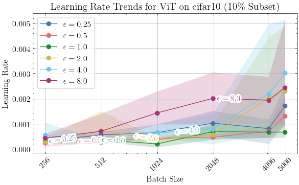
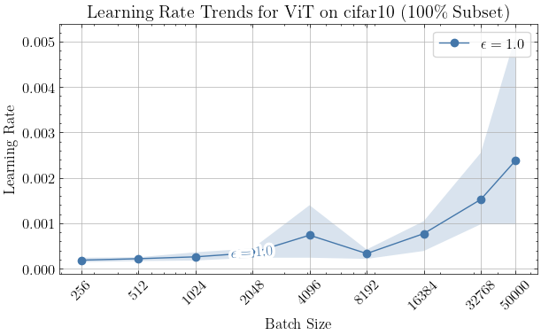
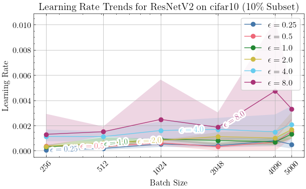
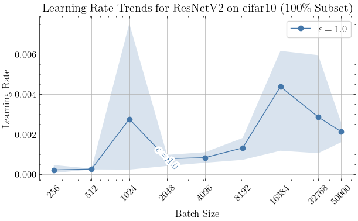
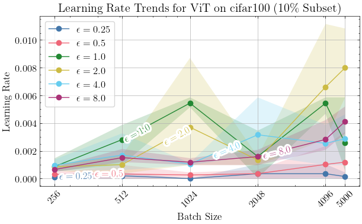
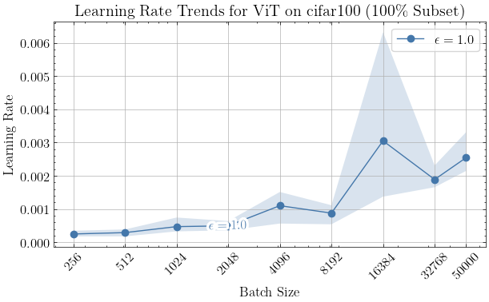
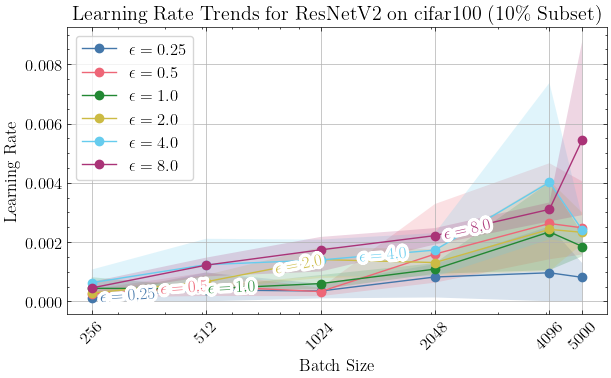
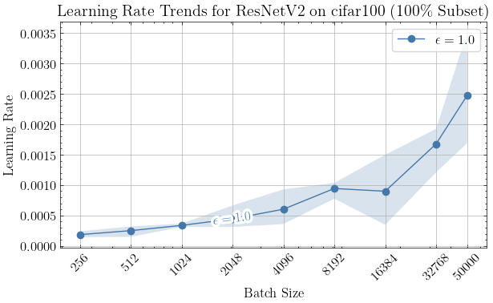

# Batch size variation

## Motivation

In differential private deep learning, understanding how different hyperparameters affect privacy and model performance is critical. Our goal is to investigate the relationship between key hyperparameters, particularly learning rate, batch size and maximum gradient norm, and their impact on the privacy-utility trade-off. We anticipate, this understanding to enable us to optimize models more effectively within the limits of privacy budgets.

Current methods for finding the optimal hyperparameter settings are often expensive and time-consuming. By systematically exploring and using Bayesian optimization, we aim to identify patterns and relationships that can lead to faster and more efficient model tuning. This work is not just about achieving better model accuracy within privacy constraints; it's about enhancing the entire process of model development in the realm of DP.

The insights from this study are expected to improve our strategies for hyperparameter selection in differential private deep learning, leading to models that are both more powerful and privacy-conscious.

## Objective

We investigate the influence of varying batch sizes on the optimal configurations of _all_ the other hyperparameters (epochs, learning_rate, max_grad_norm) using Bayesian optimization, starting with 10% of the data and then using 100% of the data for epsilon=1.

## Methodology

- **Batch Size Variation**: Systematically vary the batch size through a predefined set of values:
  - Batch sizes: \{ 2^x | x = 8, ..., 15 \} and Full batch.
- **Bayesian Optimization**: Use Bayesian optimization to find good values of the other hyperparameters (epochs, learning_rate, max_grad_norm) for each batch size.

## Models

- **Vision Transformer (vit_base_patch16_224.augreg_in21k)**
- **ResNet-50 (resnetv2_50x1_bitm_in21k)**

## Datasets

- **CIFAR-10 (10% Subset)**: We utilize a 10% subset of CIFAR-10, focusing on initial insights and quicker iterations. The full dataset is not used as it presents less challenge and may not provide meaningful differentiation for hyperparameter tuning.
- **CIFAR-100 (10% Subset)**: We start with a 10% subset of CIFAR-100, enabling rapid preliminary analysis and quicker turnarounds in the initial phases of our experimentation.
- **CIFAR-100 and CIFAR-10 (Full Dataset)**: We extend our experimentation to the full CIFAR-100 dataset to thoroughly understand model performance in more complex scenarios. However, due to the considerable resources required, we initially limit these experiments to epsilon=1.0.

## Epsilon Values

We conduct experiments with epsilon values of \{0.25, 0.5, 1, 2, 4, 8\}. For 100% of CIFAR-10 and CIFAR-100, we repeat the experiment only with epsilon=1.

## Experiment Setup

For each combination of model, dataset, batch size, and epsilon value, record:

- The batch size used
- Optimized epochs
- Optimized learning rate
- Optimized max gradient norm
- Accuracy

## Analysis

Batch size does not really seem have an effect on the accuracy. Check the experiment notebook for details.

### "Small batches train hard"

A hypothesis: The reason previous research shows that larger batches lead to better results is mainly because smaller batch sizes require more careful hyperparameter tuning.

#### Let's first take a look at this in the light of Vision transformer on CIFAR-10

> These are only with 3 repeats, bootstrapped too 1000 samples.

Here, with 10% of CIFAR-10, it seems like the smaller batch size have less variabiility

And at epsilon=1, for 100% of CIFAR-10, the effect is seems more drastic

#### And now, the same, but for ResNet

With ResNet on 10% of CIFAR-10, the effect seems to be much less

But when using the full dataset, it looks like the smaller batch sizes have less vairability, with the exception of batch size = 1024

#### Now, let's see if this still happens on CIFAR-100. First Vision transformer

On 10% of CIFAR-100, this looks the same as with CIFAR-10; mildly hints in the direction of hypothesis.

On the full dataset, it again looks like the smaller batch sizes have much less variability with respect to the learning rate

#### And of course, we will look at ResNet on CIFAR-100 also

I thin these both again hint towards the hypothesis

