# Learning Rate Variation

## Motivation

In differential private deep learning, understanding how different hyperparameters affect privacy and model performance is critical. Our goal is to investigate the relationship between key hyperparameters, particularly learning rate, batch size and maximum gradient norm, and their impact on the privacy-utility trade-off. We anticipate, this understanding to enable us to optimize models more effectively within the limits of privacy budgets.

Current methods for finding the optimal hyperparameter settings are often expensive and time-consuming. By systematically exploring and using Bayesian optimization, we aim to identify patterns and relationships that can lead to faster and more efficient model tuning. This work is not just about achieving better model accuracy within privacy constraints; it's about enhancing the entire process of model development in the realm of DP.

The insights from this study are expected to improve our strategies for hyperparameter selection in differential private deep learning, leading to models that are both more powerful and privacy-conscious.

## Objective

The goal of this experiment is to investigate the impact of varying learning rates on the optimized configuration of _all_ the other hyperparameters (epochs, batch_size, max_grad_norm) using Bayesian optimization. We will start with 10% of the CIFAR-10 and CIFAR-100 datasets and then use 100% of the data for epsilon=1.

## Methodology

- **Learning Rate Variation**: Systematically vary the learning rate through the following set values:
  - Learning rates: `0.000001`, `0.000003`, `0.000010`, `0.000032`, `0.000100`, `0.000316`, `0.001000`, `0.003162`, `0.010000`, `0.031623`, `0.100000` (`[10**x for x in np.round(np.arange(-6, -.5, .5), 2)`)
- **Bayesian Optimization**: Use Bayesian optimization to find good values of the other hyperparameters (epochs, batch_size, max_grad_norm) for each learning rate.

## Models

- **Vision Transformer (vit_base_patch16_224.augreg_in21k)**
- **ResNet-50 (resnetv2_50x1_bit.goog_in21k)**

## Datasets

- **CIFAR-10 (10% Subset)**: We utilize a 10% subset of CIFAR-10, focusing on initial insights and quicker iterations. The full dataset is not used as it presents less challenge and may not provide meaningful differentiation for hyperparameter tuning.
- **CIFAR-100 (10% Subset)**: We start with a 10% subset of CIFAR-100, enabling rapid preliminary analysis and quicker turnarounds in the initial phases of our experimentation.
- **CIFAR-100 and CIFAR-10 (Full Dataset)**: We extend our experimentation to the full datasets to better understand model performance. However, due to the considerable resources required, we initially limit these experiments to epsilon=1.0.

## Epsilon Values

Conduct experiments with epsilon values of `{0.25, 0.5, 1, 2, 4, 8}`. For 100% of CIFAR-10 and CIFAR-100, repeat the experiment only with epsilon=1.

## Experiment Setup

Record the following for each combination of model, dataset, learning rate, and epsilon value:

- Selected learning rate
- Optimized epochs
- Optimized batch size
- Optimized max gradient norm
- Accuracy

## Analysis

### Sweet spot

It looks like there might be a "sweet spot" for learning rates where the number of epochs is low, but yet the accuracy is good.

#### TL;DR

Looks like the "sweet spot" hypothesis applies to almost all dataset model combinations. The exception is 100% of CIFAR-10. But maybe that's a quirk?

> Caveat: We only have one repeat of 100% dataset and even that is only done for Vision transformer.

#### Let's first take look at Vision transformer on 10% of CIFAR-10

Focus on the learning rate = 0.001 point. First the accuracy

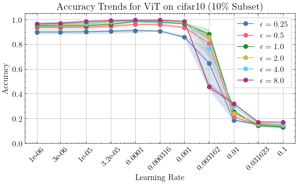

And now the number of epochs

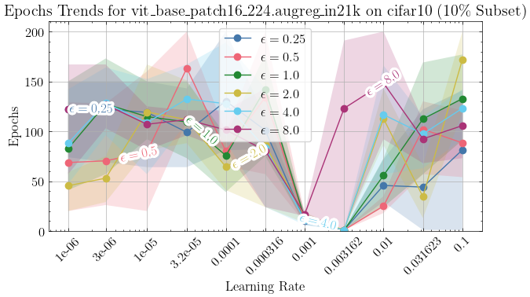

Lastly, we seem to have some trends preferring large batch sizes here

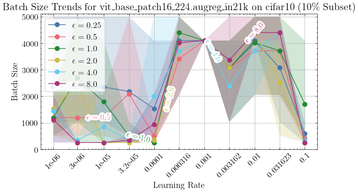

#### Next, let's see what happens with ResNet on 10% of CIFAR-10

Same thing, look at the learning rate = 0.001

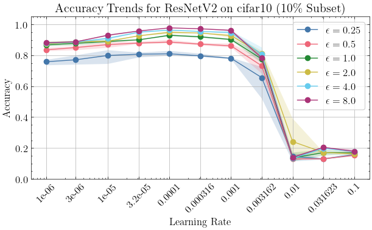

The same thing with epochs happens with this model

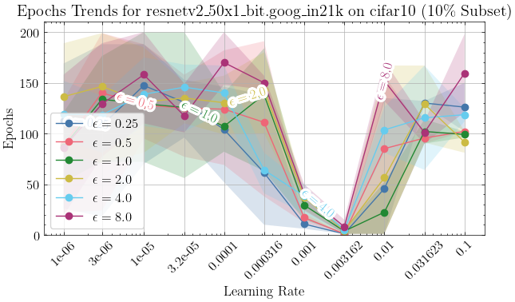

Also, at this specific learning rate, this model seems to prefer large batches

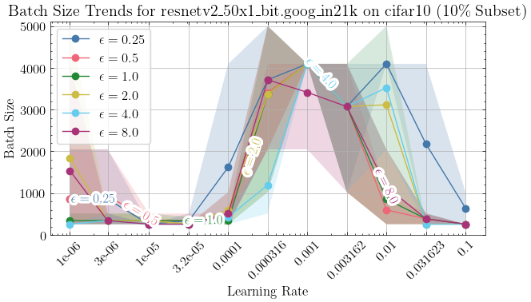

#### Now, let's focus on 10% of CIFAR-100. First Vision transformer

It's the same spot learning rate = 0.001 where the accuracy is pretty good

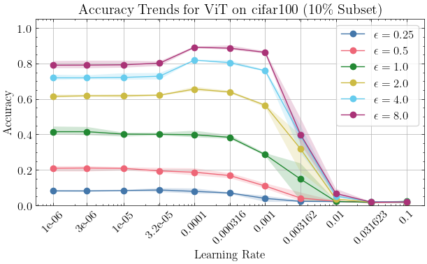

And yet again, the number of epochs seems remarkably low

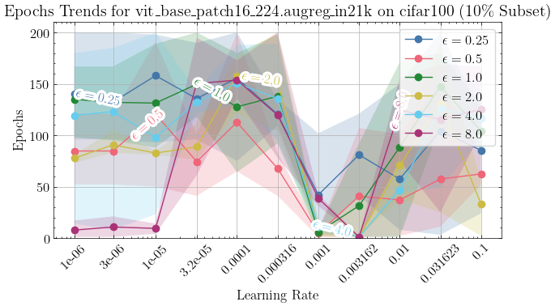

No difference with CIFAR-100. It seems to prefer larger batches with this learning rate

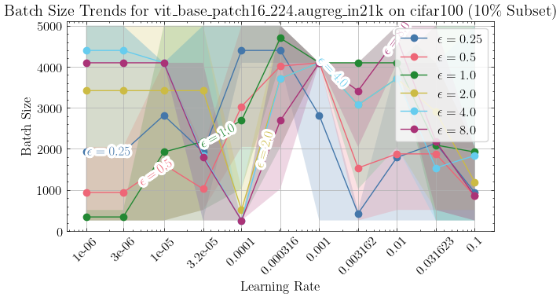

#### And now 10% of CIFAR-100, but with ResNet

Probably, not a surprise that the accuracy seems relatively nice here. Otherwise I wouldn't be doing this.

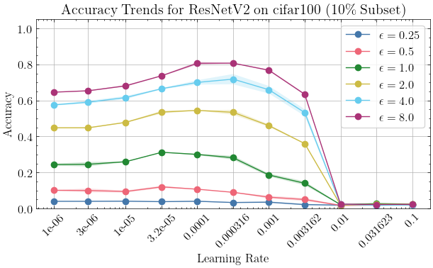

On CIFAR-100, the model seems to also need quite low number of epochs

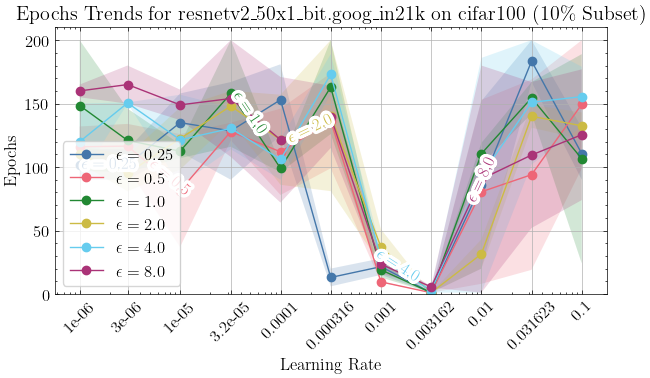

And for no big surprise: yet again big batches are preferred

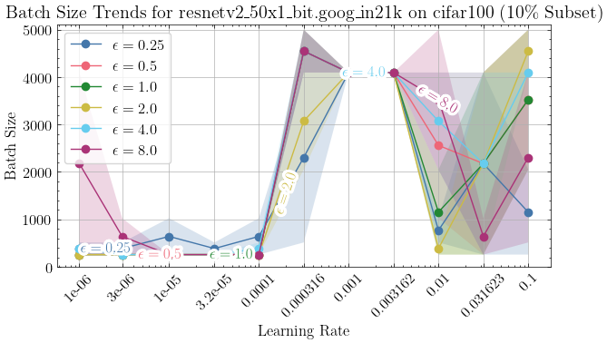

#### Lastly, let's check out how this looks on the full datasets. First CIFAR-10

> Unfortunately, we have only done full dataset only with one repeat, so there's not much data. Also, for some unknown reason, I seem to have ran this only for the Vision transformers model.

Here's the accuracy plot for CIFAR-10

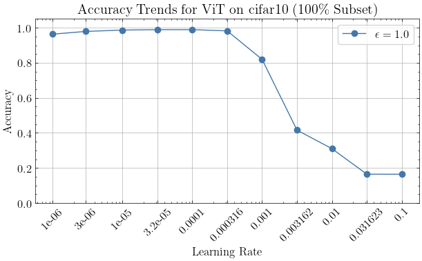

Here are the epoch trends. Thats a LOT of epochs. Maybe this is not going anywhere

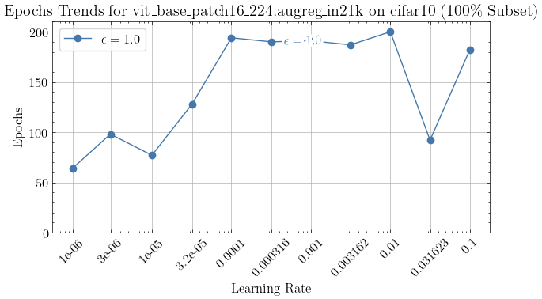

Let's anyway take a look at the batch size trends also. Based on these, looks like the possible sweet spot could be around 0.000316

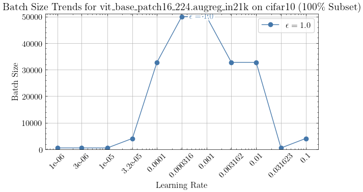

#### And finally, the same plots for CIFAR-100

First let's check the accuracy

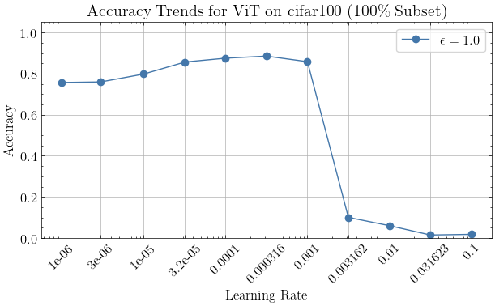

And as usually, the epochs trends. Hey, the effect might be back at the same spot with learning rate = 0.001?

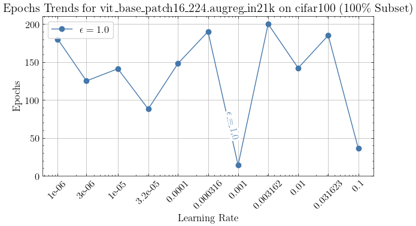

Yea. The model prefers large batches here, but so it does elsewhere.

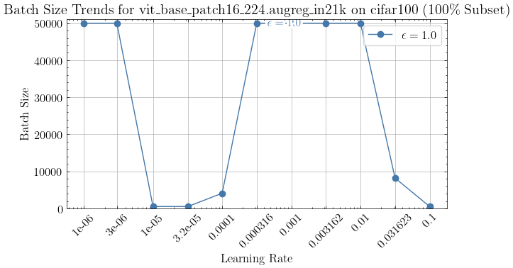

### FiLM

The same analysis, but training only FiLM parameters.

#### Vision Transformer on 10% of CIFAR-10 with FiLM Parameters

We first revisit the 10% CIFAR-10 subset with a focus on FiLM parameters of the Vision Transformer.

Yep. Looks like there might a "sweet spot" around learning rate = 0.01.

Unlike with training all parameters, the batch sizes don't seem large here. Although, this is just one repeat.

#### ResNet on 10% of CIFAR-10 with FiLM Parameters

Next, we look at the ResNet model on the same subset, training only FiLM parameters.

Here the effect is not so clear. Looks like the accuracy is starting to deteriorate with learning rates larger than 0.001.

Looks like like the model prefers large batches here.

#### Vision Transformer on 10% of CIFAR-100 with FiLM Parameters

Next, we'll take a look at the same models trained with FiLM parameters on the CIFAR-100 dataset.

Let's look at the Vision Transformer first. Looks like the sweet spot might be between 0.003162 and 0.01.

The number of epochs is yet again fairly low at around 0.01 with a couple exceptions

Again, hard to say about the batch sizes, given just the one repeat.

#### ResNet on 10% of CIFAR-100 with FiLM Parameters

Next, ResNet. Looks like we could have another sweet spot.

#### Vision Transformer on 100% of CIFAR-10 with FiLM Parameters

Next, let's look at the full CIFAR-10. Remember, when training all parameters, we did not find a sweet spot here.

For the Vision transformer looks like it does not exist.

#### ResNet on 100% of CIFAR-10 with FiLM Parameters

However, when lookin at ResNet on full CIFAR-10, we definitely can see a sweet spot.

Maybe interesting: The batch size is still low, but on the next learning rate the model seems to prefer full batch.

#### Vision Transformer on 100% of CIFAR-100 with FiLM Parameters

For the rest of these, it looks like there might be a sweet spot, but it's really hard to say because of just one repeat.

#### ResNet on 100% of CIFAR-100 with FiLM Parameters

