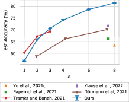

# Few-shot non-DP replication of the from scratch training experiment in "Unlocking High-Accuracy Differentially Private Image Classification through Scale" (De et al. 2022)

## Motivation

To better understand the privacy levels in DP deep learning, we want to compare those to keeping varying amount of training data private in deep learning without DP.

## Objective

Inspired by the accuracy versus epsilon trends observed in DP training from the De et al. study, we seek to map similar trajectories in a non-DP setting. By training with a series of designated shots, we will explore the impact of data volume on model accuracy, aiming to compare the results to the trends seen in DP training scenarios under varying privacy budgets, as seen below:

More specifically, we want:

- To emulate the DP training accuracy trends, as seen in the De et al. paper, within a non-DP training framework by methodically altering the number of shots.
- To discover the least amount of data necessary in non-DP training to achieve the same accuracy levels as those documented for various DP epsilon values.

## Methodology

### Models

We utilize the same WRN-16-4 and WRN-40-4 models used in the De et al. study when training from scratch under DP.

### Datasets

We will use the CIFAR-10 dataset.

We will use stratified sampling to subsample the following number of training examples (shots) per class from the dataset: 1, 5, 10, 25, 50, 100, 250, and 500. These are the same number of shots that are used in the "On the Efficacy of Differentially Private Few-shot Image Classification" (Tobaben et al. 2023).

### Training

We will train from scratch using the commonly used Kaiming-He weight initializatio (as opposed to the method by Glorot and Bengio in the De et al. paper).

We will use Bayesian optimization to optimize the batch size, the learning rate, and the number of epochs for each number of shots. We will report the achieved accuracy.

