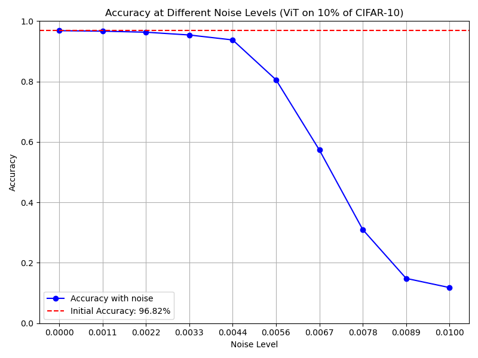

# Pretrained weight perturbation

## Motivation

For a long while, we have tried to understand when does the clipping bound matter. Recent hypothesis was that clipping bound only matters with [imbalanced class settings](10-class-imbalance.md), but yet again that hypothesis turned out to be false.

In the latest fairness results by Linzh, lower bounding the clipping threshold in adaptive clipping made a difference when training neural networks from scratch but not in logistic regression, which can be assumed to be somewhat analogous to fine-tuning. This suggests a hypothesis that training neural networks from scratch is probably more sensitive to clipping threshold than fine-tuning.

## Objective

The goal of the experiment is to test the hypothesis that clipping bound matters (only) when training from scratch.

## Methodology

We will add Gaussian noise to the pretrained weights before hyperparameter optimization. We will first add very little noise and then gradually increase the noise level to transform the model from pretrained to from scratch training setting.

We will fix the epochs at 40, use fixed clipping bounds (defined below), and optimize the other hyperparameters (batch size, learning rate) using 20 trials of Bayesian optimization.

After the optimization is done, we will evaluate the resulting model on the test set.

## Models

We will conduct the experiment using a single model using FiLM parametrization:

- **Vision Transformer (vit_base_patch16_224.augreg_in21k)**

## Ranges for hyperparameter optimization

```
batch_size:
  min: 192
  max: -1
  type: int
learning_rate:
  max: 1.0e-1
  min: 1.0e-07
  type: float
  log_space: True
```

## Datasets

We will run the experiment at least with the following dataset which combines CIFAR-10 and humans for CIFAR-100 (as an additional challenge to the model):

- **datasets/dpdl-benchmark/cifar10_10pct_plus_cifar100_humans - 10% subset**

## Epsilon Values

We will conduct the experiment with epsilon=4.0

## Clipping bounds

We will train the model using the following clipping bounds: 1e-05, 0.2500075, 0.500005, 0.7500025, 1.0 (`np.linspace(1e-5, 1, 5)`)

## Noise levels

We did pre-evaluation of the noise level by fine-tuning a ViT model on CIFAR-10 and running inference on CIFAR-10 test examples after perturbing the weights. Below are the results of the pre-evaluation:



Based on these results we will use the following noise levels: 0.001, 0.00325, 0.0055, 0.00775, 0.01 `np.linspace(1e-3, 1e-2, 5)`.

