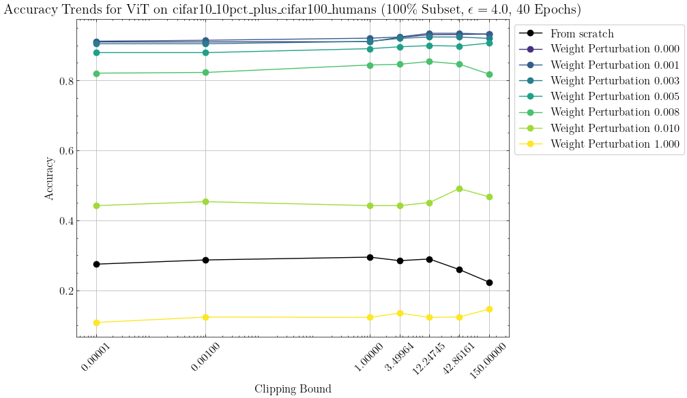
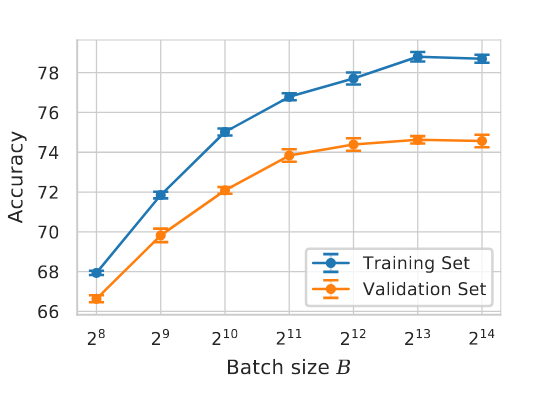

# Pretrained vs. from-scratch comparison

## Motivation

We ran [pretrained weight perturbation experiment](16-weight-perturbation.md) in the hopes of understanding if the flat accuracy lines that we have seen could be explained just because they don't matter when fine-tuning a model.

However, the idea is not working very well as when we are injecting noise to the pretrained weights, we are essentially ruining the statistics. For an example, compare the black and yellow lines in the plot below. We would expect both models to perform at about the same level, but the more efficient weight initialization make the "black" model better.



In addition, in the "Unlocking high accuracy..." [De et al. (2022)] we can see that larger batch sizes lead to better accuracies, as seen in the image below.



But we have so far seen the batch size have a very minor effect, if any. The above plot is created from scratch training, so we will want to further investigate the effect of the batch size when fine-tuning vs. training from scratch.

## Objective

We aim to properly test the above hypothesis by running multiple repeats (10) of the experiment.  We will run sweep sweep over clipping bounds and another sweep over the batch sizes and compare the achieves accuracies in fine-tuning vs from scratch training scenario.

## Methodology

We will compare two scenarios:

1. Pretrained model with a fixed set of weights.
2. Model trained from scratch with random weight initialization.

To capture potential variability, we will conduct 10 repeats per configuration to obtain reliable confidence intervals (CIs).

Again, we will fix the epochs at 40 and run the Bayesian optimization for 20 trials.

We will run two versions of the experiment:
- **Version 1**: Sweep over various clipping bounds while optimizing the other free hypers.
- **Version 2**: Sweep over batch sizes while optimizing the other free hypers.

After optimization, the resulting models will be evaluated on the test set.

For the final evaluation round on the test set, we will also collect the various gradient statistics.

## Models

## Models

We will conduct the experiment using a single model and we will train _ALL_ the parameters:

- **Vision Transformer (vit_base_patch16_224.augreg_in21k)**

## Ranges for hyperparameter optimization

```
batch_size:
  options:
  - 256
  - 512
  - 1024
  - 2048
  - 4096
  - -1
  type: categorical
learning_rate:
  max: 0.1
  min: 1.0e-7
  type: float
  log_space: True
max_grad_norm:
  max: 300
  min: 0.1
  type: float
  log_space: True

```

Note the upper bound of learning rate is much higher than in our typical experiments to reflect that typically from-scratch training benefits from higher learning rates.

The batch sizes are categorical for smaller search space. For the dataset we chose, we have 6750 training examples in total (750 for validation).

For this experiment, we have also bumped up the range for clipping bound.

## Datasets

We will run the experiment at least with the following dataset which combines CIFAR-10 and humans for CIFAR-100 (as an additional challenge to the model):

- **datasets/dpdl-benchmark/cifar10_10pct_plus_cifar100_humans - 100% subset**

## Epsilon Values

We will conduct the experiment with ε=\{ 4.0, ∞ \}

For epsilon=∞ we will configure the noise multiplier to be zero.

## Clipping bounds

We will train the model with a range of clipping bounds that consists a few very small ones and some larger ones from log space: 1e-05, 0.001, 1.0, 3.5, 12.25, 42.86, 150.0 `[1e-5, 1e-3] + list(np.geomspace(1, 150, 5)`

## Batch sizes

We will train the model with the following fixed batch sizes: 256, 512, 1024, 2048, 4096, and full batch.

