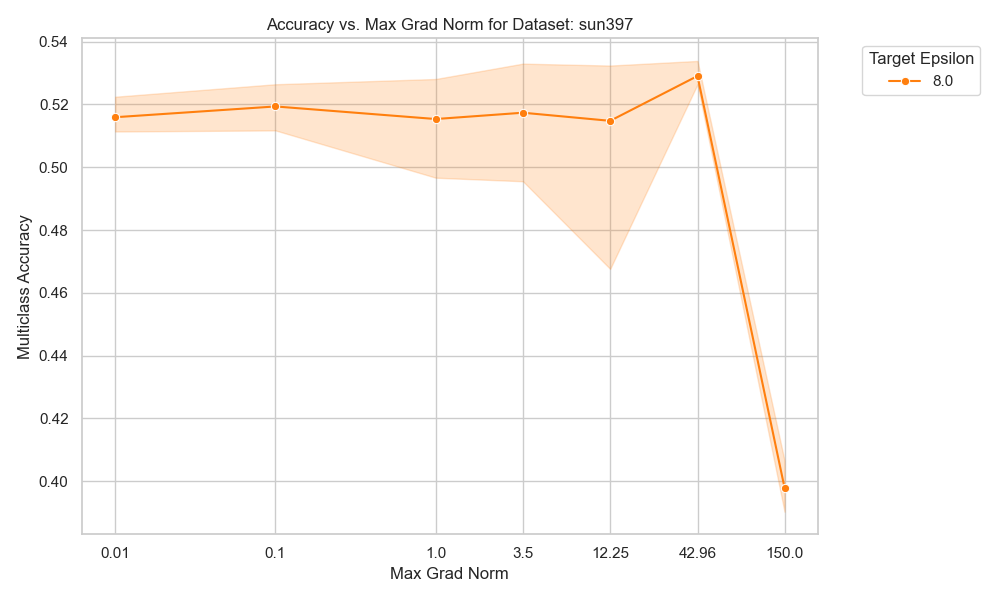
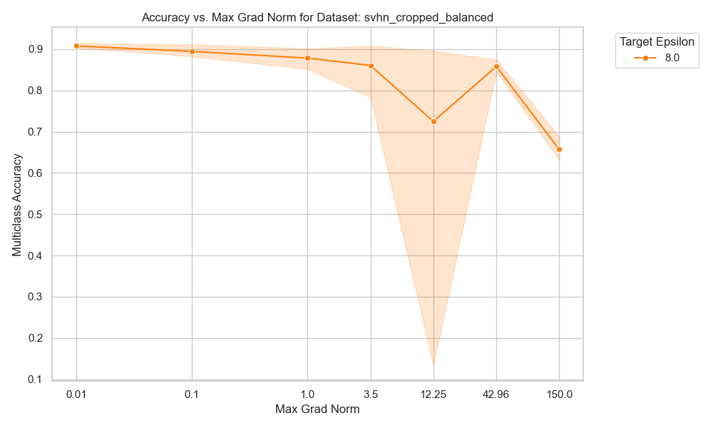
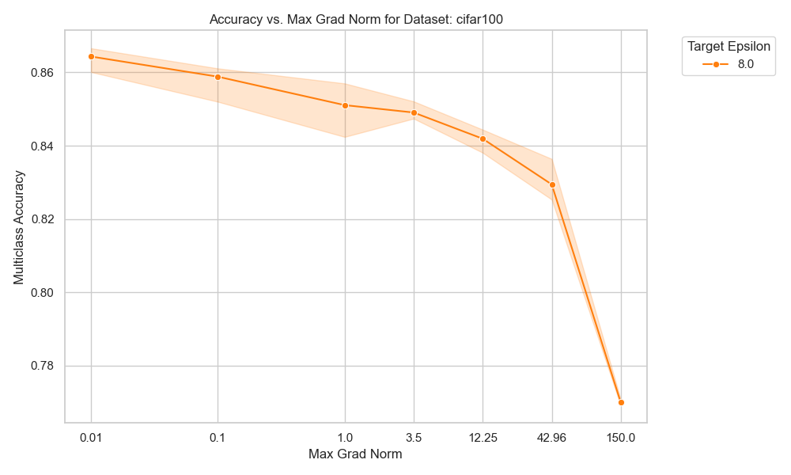
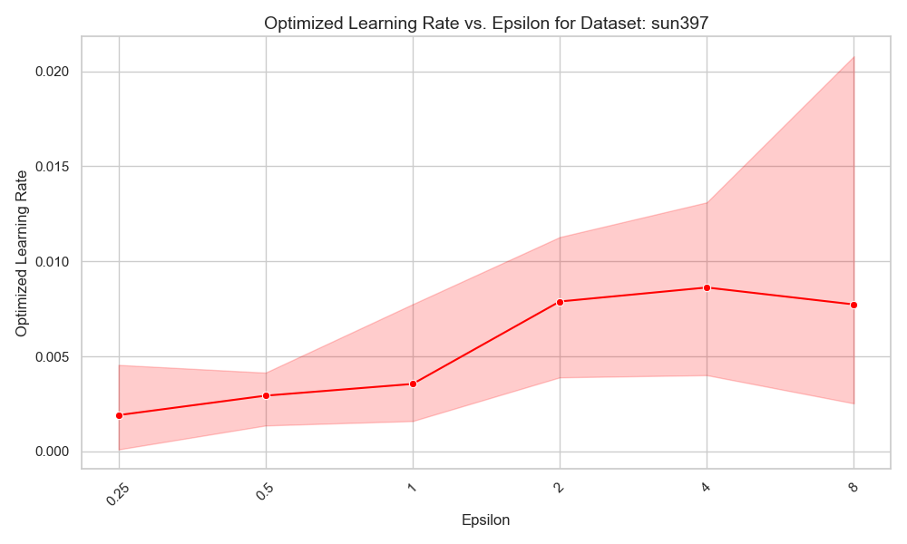
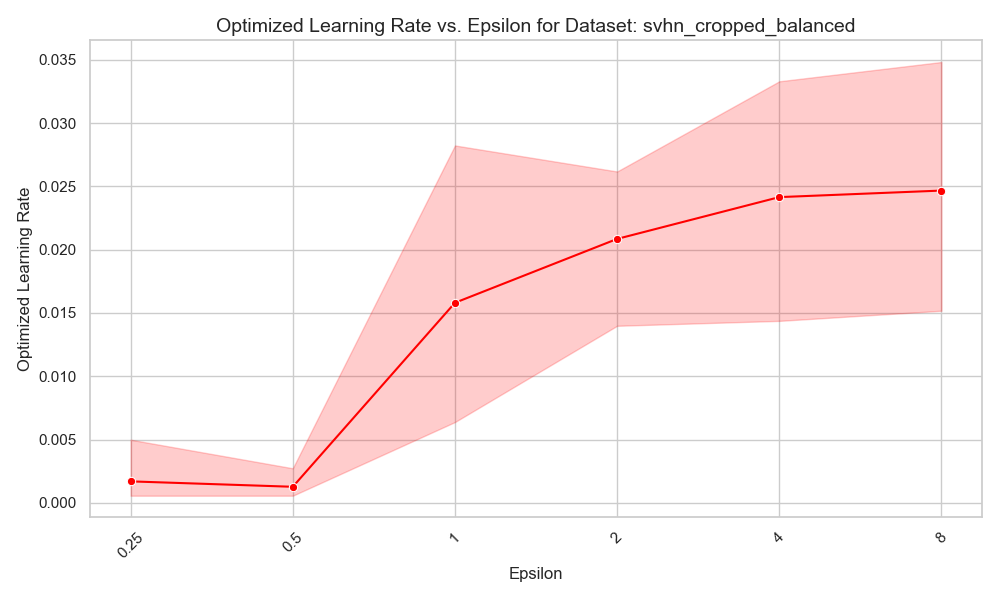
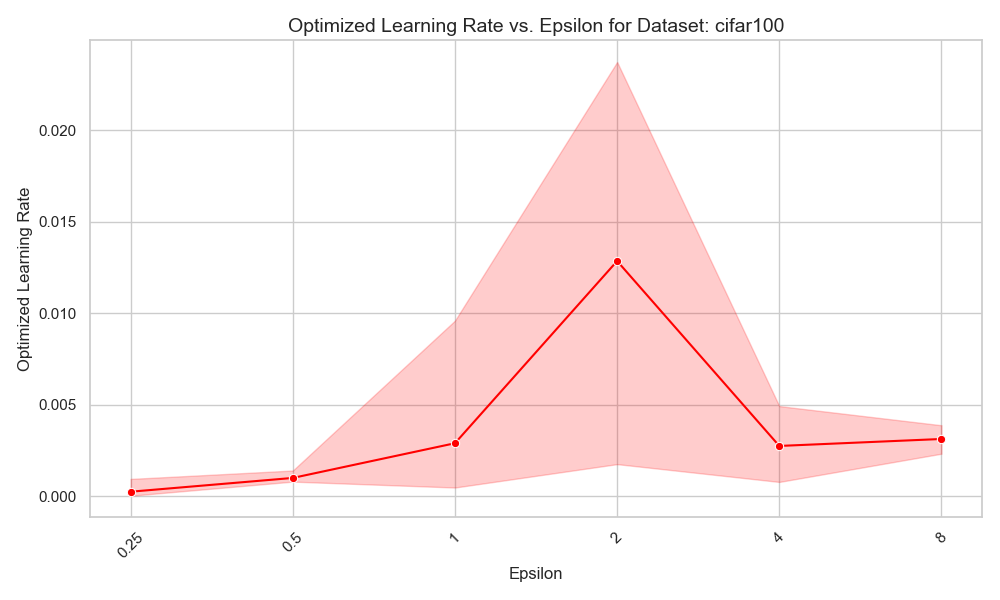
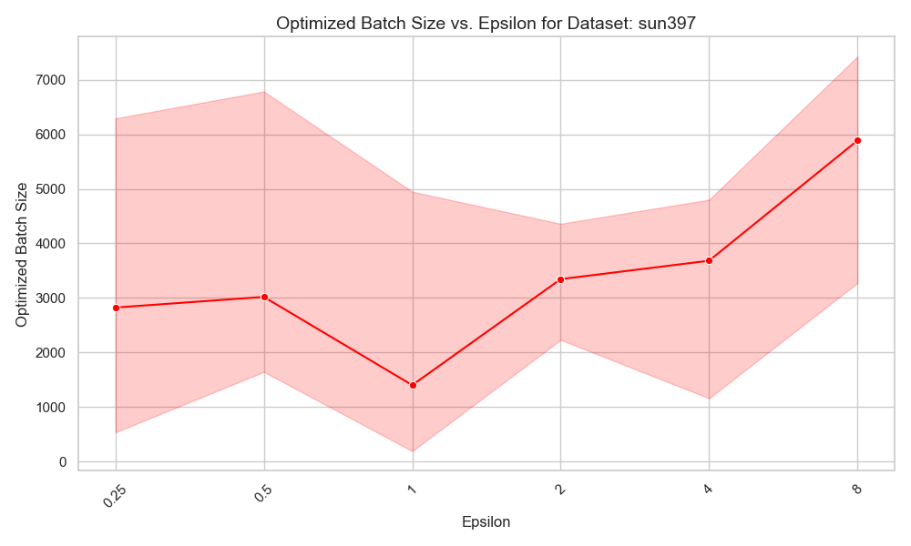
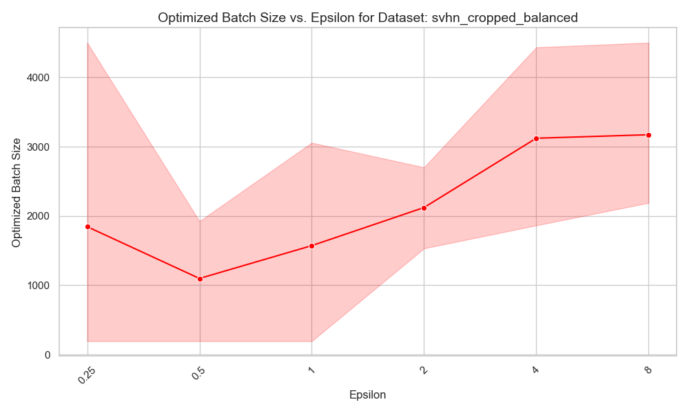
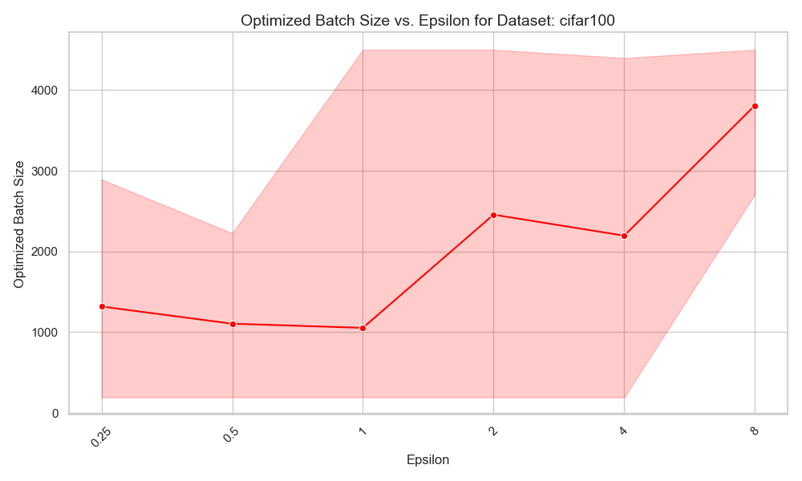
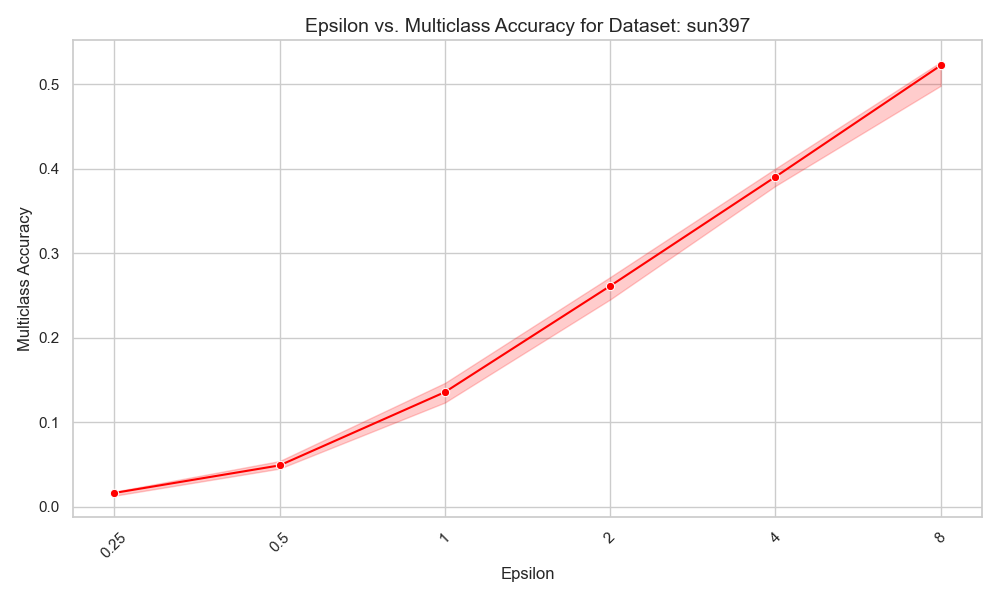

# Hyperparameter grid

## Motivation

We still have not been able to understand especially the clipping bound hyperparameter when fine-tuning deep learning models. Ih the previous experiments that we have ran, the effect of the clipping bound has been minimimal to non-existant. Futhermore, the hyperparameter optimization could be unstable enough the not be able to detect the effect of the differences in the less important hyperparameters, such as the clipping bound. Lastly, we have previously ran over 1D grids of the hyperparameters, but we never looked in to the joint effect of the hyperparamters.

## Objective

We design a grid over the hyperparameters that we will train on. The initial objecticve is to record the accuracy of the different hyperparameter combinations and inspect what kind of effects the different hyperparameters have on the resulting accuracy.

We are also interested in studying if different hyperparameter pairs (e.g. the clipping bound and the batch size) have a joint effect on the resulting accuracy.

## Methodology

We will fix the epochs at 40 and train the model using combinations drawn from the following grids:

- For 10% of sun397
  - ε: 1, 4, 8
  - LR: 0.0005, 0.0010, 0.0018, 0.0035, 0.0068, 0.0130, 0.0250 (`np.geomspace(5e-4, 0.025, 7)`)
  - BS: 192, 512, 1024, 2048, 4096, 8192, Full batch (8534)
  - CB: 0.1, 1.0, 10.0, 22.5, 35.0, 47.5, 60.0 (`[0.1, 1.0] + np.linspace(10, 60, 5).tolist()`)

- ~~For 10% of sun397 (**epsilon specific grid**)~~
  - ~~ε: 8~~
  - ~~LR: 0.003 0.004 0.005 0.007 0.010 0.014 0.020 (`np.geomspace(0.0025, 0.02, 7)`)~~
  - ~~BS: 3275, 3841, 4506, 5286, 6201, 7274, Full batch (8534) (`map(math.floor, np.geomspace(3275, 8534, 7)`)~~
  - ~~CB: 0.10, 1.75, 3.40, 5.05, 6.70, 8.35, 10.00 (`np.linspace(0.1, 10, 7)`)~~

- For 10% of SVHN (Balanced)
  - ε: 1, 4, 8
  - LR: 0.0005, 0.0010, 0.0021, 0.0042, 0.0085, 0.0172, 0.0350 (`np.geomspace(5e-4, 0.035, 7)`)
  - BS: 192, 512, 1024, 2048, 4096, Full batch
  - CB: 0.001, 0.005, 0.025, 0.122, 0.608, 3.020, 15.000 (`np.geomspace(1e-3, 15, 7)`)

- For 10% of CIFAR-100
  - ε: 1, 4, 8
  - BS: 192, 512, 1024, 2048, 4096, Full batch
  - LR: 0.0005, 0.0010, 0.0018, 0.0035, 0.0068, 0.0130, 0.0250 (`np.geomspace(5e-4, 0.025, 7)`)
  - CB: 0.001, 0.004, 0.017, 0.071, 0.292, 1.209, 5.000 (`np.geomspace(1e-3, 5, 7)`)

## Motivation for hyperparameter ranges

In [experiment on difficult datasets](20-difficult-datasets.md) we performed analysis on the hyperparameters via two methods:
- Sweep over range of hyperparameters and optimize the others
- Optimize all hyperparameters for a range of epsilons

Based on these results, we decided to select the above ranges.

~~After initial test run using the same range for all epsilon, we will run a comparison with using epsilon specific grids.~~ Turned out that the epsilon specific grids are not very useful--the average accuracy was too high to detect any patterns.

The below plots motivate our initial decisions on grid values.

#### Clipping bound

  
  
  

### Learning rate

  
  
  

### Batch size

  
  
  

### Extended epsilon range for SUN397

  

## Models

We will conduct the experiment using a single model and we will train FiLM parameters.

- **Vision Transformer (vit_base_patch16_224.augreg_in21k)**

## Datasets

These datasets seemed to display different response with respect to the hyperparameters in [previous experiment on difficult datasets based on our findings using 10% of SUN397 dataset](20-difficult-datasets.md):

- **datasets/dpdl-benchmark/sun397 - 10% subset**
- **datasets/dpdl-benchmark/svhn_cropped_balanced - 10% subset**
- **datasets/cifar100 - 10% subset**

