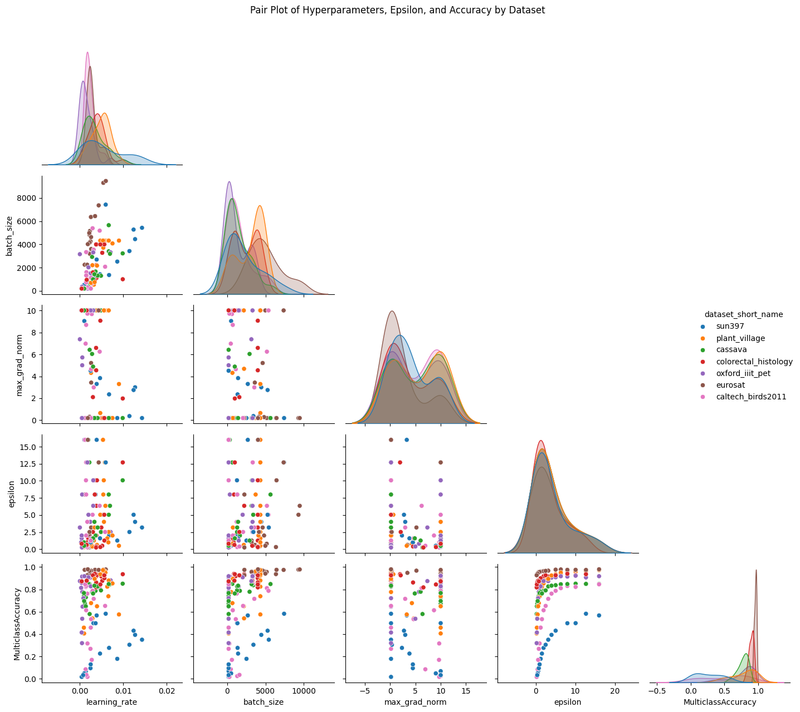

# Difficult datasets

## Motivation

When further analyzing data from privacy assistant evaluation experiment, we noticed that the most difficult dataset (SUN397) had correlations between hyperparameters that we have not seen earlier. This effect can be seen in the plot below (blue markers):

This hints that our previous attempts at analyzing the effect of the hyperparameters might have been flawed, simply because of using datasets that are too easy. In this experiment, we would like to test if this is true.

## Objective

In the early experiments, we did sweeps over batch sizes, clipping bounds, and learning rates while optimizing the other (free) hyperparamters. The goal was to find interesting/exploitable features of the hyperparameters. In this experiment, we will repeat those sweeps using selected datasets--at least SUN397.

We will define a grid for one hyperparameter at a time, optimize the others, and record the resulting accuracy.

## Methodology

We will fix epochs at 40 and run 20 trials of Bayesian optimization.

- We will construct a logarithmic grid for the learning rates in the range [1e-4, 0.05].
- For the batch sizes we will use a logarithmic grid [256, 512, 1024, 2048, 4096, 8196, -1], where -1 denotes full batch.
- For the clipping bound we will use the grid [1e-2, 0.1, 1, 3.5, 12.25, 42.96, 150.0] (`[1e-2, 0.1] + list(np.geomspace(1, 150, 5))`)

For each grid, we will sweep over the values while optimizing the free hyperparameters and evaluate the resulting model on the test set.

- ε = {0.25, 0.5, 1, 2, 4, 8}

## Models

We will conduct the experiment using a single model and we will train FiLM parameters:

- **Vision Transformer (vit_base_patch16_224.augreg_in21k)**

## Datasets

We will initially conduct the experiments with a single dataset that we know should be interesting:

- **dpdl-benchmark/sun397 - 10% subset**

Baesd on the results we will run the experiments on further datasets with ranging difficultive. Alternatively, we might design contiunation experiments with artificial difficulty, such as corrupting labels.
