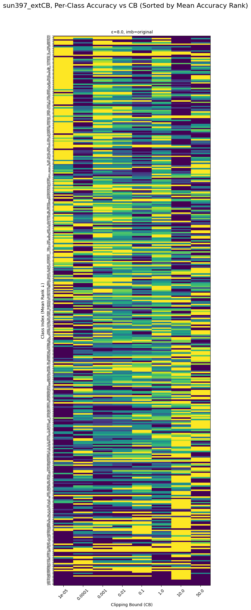

# Clipping bound hypothesis

## Motivation

We have seen in our experiments that the SUN397 dataset seems to prefer larger (>1) clipping bounds. Other datasets that we experimented with, seem to prefer either a small (≈0.1) or a very small (≈10^-4) clipping bound.

After analyzing the results, we have formed hypotheses about what may cause this: **The balance between easy/difficult classes/examples**.

See, for example in the heatmap below, we have the classes ranked such that the most difficult classes are at the bottom and the easiest classes are at the top. **In the top left corner we have easy classes and small clipping bounds having high accuracy**. And **in the bottom right corner we have the difficult classes having best accuracy with higher clipping bounds**. NB: When clipping bound is 50, the accuracy starts degrade again in the bottom right corner.

**NB**: This is for _macro_ accuracy.

## Objective

The goal of the experiment is to test the following hypothesis that we formed from the observations on SUN397. Let,

* Cₑ, Cₕ = # easy and # hard classes  
* Nₑ, Nₕ = total samples in easy and hard classes  

The optimal clipping bound depends on which group dominates the metric being optimised:

| Metric (weighting) | Dominance test | If easy dominate | If hard dominate |
|--------------------|----------------|------------------|------------------|
| **Macro accuracy** (equal weight per class) | Compare Cₑ to Cₕ | **Small bound** | **Large bound** |
| **Micro accuracy** (equal weight per sample) | Compare Nₑ to Nₕ | **Small bound** | **Large bound** |

In short: **majority rules**--the group contributing more to the metric dictates whether the optimum is small or large.

## Methodology

We will fix the epochs at 40 and train the models on a grid of hyperparameters

- Batch size: 192, 512, 1024, 2048, 4096, Full batch
- Clipping bound: 1e-5, 1e-4, 1e-3, 1e-2, 1e-1, 1, 10
- Learning rate: 0.00050, 0.00087, 0.00153, 0.00267, 0.00468, 0.00818, 0.01430, 0.02500 (`np.geomspace(5e-4, 0.025, 8)`)

We will construct datasets from ImageNet-1k to test the hypotheses. We will train a model pre-trained on ImageNet-21k on the grid and evaluate the micro/macro accuracies.

We will determine the difficult/easy classes using the ImageNet-1k confusion matrix and per-class accuracies we obtained by performing a forward pass using a model pretrained on ImageNet-1k (DeIT-Base).

## Models

- **Vision Transformer (vit_base_patch16_224.augreg_in21k)**

We will use the FiLM parameterization.

## Datasets

To remove dataset size as a confounder, every non-SUN split contains **7 500 training images**.  

| Name | Dominance condition | Easy classes | Difficult classes | Images / easy class | Images / difficult class | Total imgs | Metric | CB Hypothesis |
|------|--------------------|--------------|-------------------|---------------------|--------------------------|------------|------------------|----------|
| **imagenet-mini-class-easy** | *Class-count* easy-heavy | 10 | 5 | 500 | 500 | 7 500 | Macro | **Small** |
| **imagenet-mini-sample-easy** | *Sample-count* easy-heavy | 5 | 5 | 1 000 | 500 | 7 500 | Micro | **Small** |
| **imagenet-mini-class-hard** | *Class-count* difficult-heavy | 5 | 10 | 500 | 500 | 7 500 | Macro | **Large** |
| **imagenet-mini-sample-hard** | *Sample-count* difficult-heavy | 5 | 5 | 500 | 1 000 | 7 500 | Macro | **Large** |
| **imagenet397-easy** (10% subset) | SUN-style easy-heavy | 350 easiest | 47 hardest | ≈ 200 | ≈ 200 | 76 127 | Macro/Micro | **Small** |
| **imagenet397-hard**  (10% subset) | SUN-style difficult-heavy | 47 easiest | 350 hardest | ≈ 200 | ≈ 200 | 76 127 | Macro/Micro | **Large** |

**Construction details**

1. Images are sampled without replacement.
2. The difficulty/easyness is determined from the confusion matrix and per-class accuracies that we obtained from a forward pass through ImageNet-1k using a Vision Transformer pre-trained on ImageNet-1k (DeIT-Base).
3. There is no separate validation split (this can be split from train split if needed).
4. The ImageNet-1k validation split is used as the test test (no labels are provided for ImageNet-1k test split).

## Epsilon Values

We will run the experiment over ε = { 8 }.
